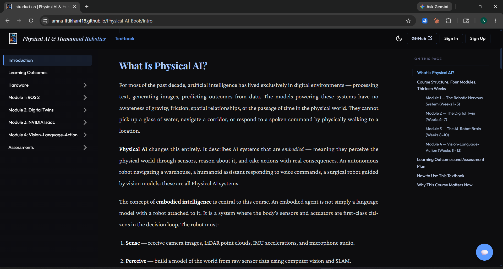

<div align="center">

# Physical AI & Humanoid Robotics

**An AI-native university textbook — live, searchable, and conversational**

[](https://Amna-Iftikhar418.github.io/Physical-AI-Book/)
[](https://railway.app)
[](https://docusaurus.io)
[](https://fastapi.tiangolo.com)
[](https://ai.google.dev)

*ROS 2 · Digital Twins · NVIDIA Isaac · Vision-Language-Action Models*

<br/>



</div>

---

## What Is This?

A full university-level textbook on Physical AI and Humanoid Robotics, paired with an embedded RAG chatbot that answers questions grounded **exclusively** in the book's content. Every page has a floating chat assistant, text-selection contextual Q&A, per-chapter AI personalization, and Urdu translation — all deployed and live.

Built for the **Panaversity Hackathon I** using Spec-Driven Development. Score: **300 / 300 pts**.

---

## Features

| Feature | Description |
|---------|-------------|
| **18-chapter textbook** | 4 modules covering ROS 2, Digital Twins, NVIDIA Isaac, and VLA models |
| **RAG chatbot** | Answers grounded in the book — never hallucinates beyond it |
| **Text-selection Q&A** | Select any passage → "Ask about this" → chapter-scoped answer |
| **JWT Auth** | Signup with background survey; signin; persistent sessions |
| **AI Personalization** | Rewrites chapters for your skill level (beginner → advanced) |
| **Urdu Translation** | Full prose translated; code blocks preserved exactly |
| **Claude Code subagents** | `qdrant-indexer` subagent + `/generate-chapter-outline` skill |
| **Neural Circuit theme** | Custom dark UI — navy backgrounds, gold headings, electric blue accents |

---

## Architecture

```
┌──────────────────────────────────────────────────────────────────┐
│                      FRONTEND  (GitHub Pages)                    │
│  Docusaurus 3.10 · React 19 · TypeScript                         │
│                                                                  │
│  Root.tsx          →  FAB chat button + text-selection button    │
│  ChatPanel.tsx     →  Streaming chat UI with source citations    │
│  AuthButton.tsx    →  Signup / signin modal (JWT stored locally) │
│  PersonalizeBtn    →  AI rewrite for user's skill level          │
│  TranslateBtn      →  Urdu translation toggle                    │
└─────────────────────────────┬────────────────────────────────────┘
                              │  HTTPS REST API
┌─────────────────────────────▼────────────────────────────────────┐
│                      BACKEND  (Railway · Docker)                 │
│  FastAPI 0.115 · Python 3.11 · uvicorn                           │
│                                                                  │
│  POST /api/chat             RAG query (any chapter)              │
│  POST /api/chat/select      RAG query (chapter-scoped)           │
│  POST /api/auth/signup      Create account + skill profile       │
│  POST /api/auth/signin      Issue JWT                            │
│  GET  /api/auth/session     Verify JWT → user info               │
│  GET  /api/user/profile     Fetch skill profile                  │
│  POST /api/personalize      AI rewrite for skill level           │
│  POST /api/translate        Gemini Urdu translation              │
│  GET  /health               Liveness probe                       │
└──────────┬───────────────────────────────┬───────────────────────┘
           │                               │
┌──────────▼──────────┐       ┌────────────▼──────────────────────┐
│  Neon Serverless    │       │  Qdrant Cloud                     │
│  Postgres           │       │  collection: chapter_chunks       │
│                     │       │                                   │
│  users              │       │  3072-dim COSINE vectors          │
│  user_profiles      │       │  gemini-embedding-2               │
│  conversations      │       │  score_threshold: 0.70            │
│  messages           │       │  top_k: 5                         │
└─────────────────────┘       └───────────────────────────────────┘
```

---

## Tech Stack

| Layer | Technology |
|-------|-----------|
| Frontend framework | Docusaurus 3.10.1 + React 19 |
| Frontend language | TypeScript |
| Frontend hosting | GitHub Pages (auto-deploy via Actions) |
| Backend framework | FastAPI 0.115 |
| Backend language | Python 3.11 |
| Backend hosting | Railway (Docker container) |
| AI / LLM | Google Gemini 2.5 Flash |
| Embeddings | Google `gemini-embedding-2` (3072 dims) |
| Vector store | Qdrant Cloud |
| Relational DB | Neon Serverless Postgres (asyncpg) |
| Auth | JWT HS256 (python-jose) + bcrypt |
| ORM | SQLAlchemy (async) |

---

## Quick Start

### Prerequisites

- Node.js 20+, Python 3.11+, Git
- Google AI Studio API key
- Qdrant Cloud cluster (free tier works)
- Neon Postgres database (free tier works)

### 1 — Clone

```bash
git clone https://github.com/Amna-Iftikhar418/Physical-AI-Book.git
cd Physical-AI-Book
```

### 2 — Frontend

```powershell
cd book
npm install
npm start        # → http://localhost:3000
```

### 3 — Backend

```powershell
cd backend
python -m venv .venv
.venv\Scripts\Activate.ps1
pip install -r requirements.txt
```

Create `backend/.env` (never committed):

```env
GOOGLE_API_KEY=<Google AI Studio key>
QDRANT_URL=<Qdrant Cloud cluster URL>
QDRANT_API_KEY=<Qdrant Cloud API key>
DATABASE_URL=<Neon Postgres connection string>
CORS_ORIGINS=http://localhost:3000,https://Amna-Iftikhar418.github.io
JWT_SECRET_KEY=<random 32+ char secret>
```

```powershell
.venv\Scripts\uvicorn main:app --reload   # → http://localhost:8000
```

Verify:

```powershell
curl http://localhost:8000/health
# {"status":"ok","version":"1.0.8"}
```

### 4 — Index book content into Qdrant

Only needed once (or after editing chapters):

```powershell
python backend/scripts/build_manifest.py        # build backend/docs_manifest.json
python backend/subagents/index_to_qdrant.py     # embed + upsert to Qdrant
```

Or invoke the `qdrant-indexer` Claude Code subagent — it handles both steps automatically.

---

## Project Structure

```
.
├── book/                       Docusaurus 3 frontend
│   ├── docs/                   18 chapter MDX files (4 modules)
│   ├── src/
│   │   ├── components/
│   │   │   ├── ChatWidget/     ChatPanel, SelectionButton, FAB
│   │   │   ├── Auth/           AuthButton (signup/signin modal)
│   │   │   └── PersonalizationBar/  PersonalizeButton, TranslateButton
│   │   ├── theme/              Swizzled: Root, Footer, Navbar, DocBreadcrumbs
│   │   ├── lib/                api-client.ts, auth-client.ts
│   │   └── css/                custom.css — Neural Circuit dark theme
│   └── docusaurus.config.ts    Site config + apiUrl customField
│
├── backend/                    FastAPI RAG backend
│   ├── routers/                chat.py, auth.py, health.py, personalize.py, translate.py
│   ├── services/               rag.py, agents.py, personalization.py, translation.py
│   ├── db/                     SQLAlchemy models, asyncpg connection, Alembic migrations
│   ├── subagents/              index_to_qdrant.py
│   ├── scripts/                build_manifest.py
│   ├── utils/                  retry.py (exponential backoff for Gemini API)
│   ├── auth.py                 JWT + bcrypt helpers
│   ├── config.py               Env var loading + validation
│   ├── main.py                 App entry, CORS, lifespan, router wiring
│   ├── docs_manifest.json      Chapter text cache for personalization + indexing
│   └── Dockerfile              Railway deploy
│
├── .claude/
│   ├── agents/qdrant-indexer.md    Subagent: re-index Qdrant after chapter edits
│   └── commands/generate-chapter-outline.md   Skill: generate chapter outlines
│
├── .specify/memory/constitution.md  Authoritative product spec
├── specs/                      SDD feature specs, plans, and task lists
├── history/                    Prompt History Records + Architecture Decision Records
├── .github/workflows/          deploy-book.yml → GitHub Pages
├── railway.json                Railway build + healthcheck config
└── README.md
```

---

## Deployment

| Component | Platform | Trigger |
|-----------|----------|---------|
| Frontend (book) | GitHub Pages | Auto on push to `main` |
| Backend (API) | Railway (Docker) | Auto on push to `main` |
| Vector index | Qdrant Cloud | Manual via `qdrant-indexer` subagent |
| Database schema | Neon Postgres | SQLAlchemy auto-creates tables on startup |

**Required Railway env vars**: `GOOGLE_API_KEY`, `QDRANT_URL`, `QDRANT_API_KEY`, `DATABASE_URL`, `CORS_ORIGINS`, `JWT_SECRET_KEY`

**Required GitHub Actions secret**: `DOCUSAURUS_API_URL` (set to the Railway backend URL)

---

## Claude Code Agents

Two reusable artifacts ship with the repo:

### `/generate-chapter-outline`

```
.claude/commands/generate-chapter-outline.md
```

Reads the constitution and requirements, then generates a structured Markdown outline for any chapter — H2 sections aligned to the 13-week schedule, sub-topic bullets, code-example placeholders, and learning objectives mapped to LO1–LO6.

```
/generate-chapter-outline module-1-ros2/week-3-5-ros2-fundamentals
```

### `qdrant-indexer` subagent

```
.claude/agents/qdrant-indexer.md
```

Rebuilds `docs_manifest.json` if needed, runs `index_to_qdrant.py`, and reports chapter count, chunk count, and any failures. Invoke it any time a chapter MDX file changes.

---

## Content

| Module | Topic | Chapters |
|--------|-------|---------|
| 1 | ROS 2 Fundamentals | 5 |
| 2 | Digital Twins | 4 |
| 3 | NVIDIA Isaac Platform | 5 |
| 4 | Vision-Language-Action Models | 4 |

**Total**: 18 chapters · 4 modules · 13-week curriculum

---

## Author

**Amna Iftikhar**  
[GitHub](https://github.com/Amna-Iftikhar418) 
