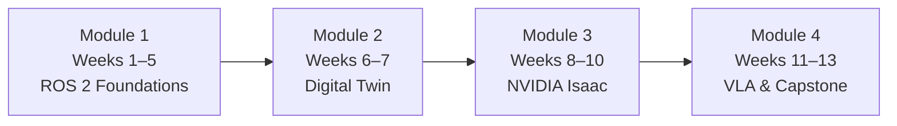

# Introduction to Physical AI & Humanoid Robotics

> **Learning Objectives**
> - **LO1**: Understand Physical AI principles and the concept of embodied intelligence operating in the physical world
> - **LO2**: Gain orientation on how ROS 2 serves as the robotic nervous system throughout this course
> - **LO5**: Appreciate the role of humanoid robot design in bridging digital AI with physical interaction

---

## What Is Physical AI?

For most of the past decade, artificial intelligence has lived exclusively in digital environments — processing text, generating images, predicting outcomes from data. The models powering these systems have no awareness of gravity, friction, spatial relationships, or the passage of time in the physical world. They cannot pick up a glass of water, navigate a corridor, or respond to a spoken command by physically walking to a location.

**Physical AI** changes this entirely. It describes AI systems that are *embodied* — meaning they perceive the physical world through sensors, reason about it, and take actions with real consequences. An autonomous robot navigating a warehouse, a humanoid assistant responding to voice commands, a surgical robot guided by vision models: these are all Physical AI systems.

The concept of **embodied intelligence** is central to this course. An embodied agent is not simply a language model with a robot attached to it. It is a system where the body's sensors and actuators are first-class citizens in the decision loop. The robot must:

1. **Sense** — receive camera images, LiDAR point clouds, IMU accelerations, and microphone audio.
2. **Perceive** — build a model of the world from raw sensor data using computer vision and SLAM.
3. **Plan** — decide what to do next given a goal and a world model.
4. **Act** — send motor commands, navigate to a waypoint, grasp an object.

Humanoid robots are uniquely positioned for human-centric environments precisely because they share our physical form. Doors, stairs, chairs, keyboards, and tools are all designed for human-shaped bodies. A robot with two arms, two legs, a torso, and a head can be trained with abundant data from human demonstrations because the morphology matches.

This course bridges the gap between the AI models you already know and the robot controllers that turn decisions into physical motion. By the end of the thirteen weeks, you will have built, simulated, and deployed a complete Physical AI system.

```python
# The "brain-to-body" concept in one function:
# An AI decision is mapped to a named ROS 2 action
def intent_to_action(natural_language_command: str) -> str:
    """
    Translate a natural language intent to a ROS 2 action name.
    In Module 4 this will call an LLM; for now it illustrates the concept.
    """
    action_map = {
        "clean the room": "navigate_and_sweep",
        "bring the box": "navigate_and_grasp",
        "go to the door": "navigate_to_waypoint",
    }
    return action_map.get(natural_language_command.lower(), "idle")

# Output: "navigate_and_grasp"
print(intent_to_action("bring the box"))
```

---

## Course Structure: Four Modules, Thirteen Weeks

This course is organised into four sequential modules. Each module builds on the one before it, and each culminates in a graded assessment. The thirteen-week breakdown is as follows:



### Module 1 — The Robotic Nervous System (Weeks 1–5)

ROS 2 (Robot Operating System 2) is the communication middleware that connects every component of a physical robot. Think of it as the nervous system: sensors publish data, the brain subscribes to it, and actuators receive commands. In the first five weeks you will learn:

- **Weeks 1–2**: Physical AI foundations, the humanoid robotics landscape, embodied intelligence principles, and sensor systems (LiDAR, depth cameras, IMUs, force-torque sensors).
- **Weeks 3–5**: ROS 2 architecture — nodes, topics, services, and actions. Writing Python publishers and subscribers with `rclpy`. Building ROS 2 packages, launch files, parameter servers, and URDF robot description files.

**Assessment 1**: Build a complete ROS 2 Python package with a publisher, subscriber, and launch file.

### Module 2 — The Digital Twin (Weeks 6–7)

Before you can deploy a robot in the real world, you must test it in a physics-accurate simulation. Module 2 covers two simulation environments:

- **Gazebo**: The standard open-source robot simulator. You will configure a robot in URDF/SDF format, add physics-accurate sensors (LiDAR, depth cameras, IMUs), and run closed-loop control experiments.
- **Unity**: A high-fidelity game engine used for photorealistic rendering and human-robot interaction testing. You will set up the ROS–Unity bridge and use Unity for visual scenarios that Gazebo cannot render.

**Assessment 2**: Implement a complete Gazebo simulation of a robot navigating a custom environment with at least two sensor types.

### Module 3 — The AI-Robot Brain (Weeks 8–10)

NVIDIA Isaac is a suite of tools purpose-built for AI-powered robotics:

- **Isaac Sim**: A photorealistic simulation environment built on NVIDIA Omniverse. You will generate synthetic training datasets and run reinforcement learning experiments.
- **Isaac ROS**: Hardware-accelerated ROS 2 packages running on Jetson hardware. You will deploy Visual SLAM (VSLAM), Nav2 path planning for bipedal movement, and the full AI manipulation pipeline.
- **Sim-to-Real Transfer**: Techniques for closing the reality gap — domain randomisation, curriculum learning, and deploying trained models to Jetson Orin hardware.

**Assessment 3**: Implement an Isaac-based perception pipeline with VSLAM and obstacle-aware navigation.

### Module 4 — Vision-Language-Action (Weeks 11–13)

The final module connects large language models to robot action planning:

- **Weeks 11–12**: Humanoid kinematics and dynamics, bipedal locomotion and balance control, manipulation and grasping with articulated hands, human-robot interaction design.
- **Week 13**: OpenAI Whisper for voice-to-action pipelines, LLM-based cognitive planning ("Clean the room" → sequence of ROS 2 actions), multi-modal interaction (speech, gesture, vision).

**Assessment 4 (Capstone)**: The Autonomous Humanoid. A simulated robot receives a voice command, plans a path, navigates obstacles, identifies an object with computer vision, and manipulates it — all as a single end-to-end system.

---

## Learning Outcomes and Assessment Plan

The course delivers six learning outcomes (LOs). The table below maps each outcome to the module and assessment that addresses it most directly.

| Learning Outcome | Module | Assessment |
|------------------|--------|------------|
| LO1: Physical AI principles and embodied intelligence | Module 1 (Weeks 1–2) | Throughout |
| LO2: ROS 2 for robotic control | Module 1 (Weeks 3–5) | Assessment 1 |
| LO3: Robot simulation with Gazebo and Unity | Module 2 (Weeks 6–7) | Assessment 2 |
| LO4: NVIDIA Isaac AI robot platform | Module 3 (Weeks 8–10) | Assessment 3 |
| LO5: Humanoid robot design for natural interactions | Module 4 (Weeks 11–12) | Capstone |
| LO6: GPT model integration for conversational robotics | Module 4 (Week 13) | Capstone |

Each assessment is cumulative. Assessment 2 (Gazebo) requires the ROS 2 package built in Assessment 1. The Capstone integrates all four modules into a single working system.

The **minimum viable development environment** is:

- **Digital Twin Workstation**: x86-64 CPU, NVIDIA RTX GPU (8GB+ VRAM), 64GB RAM, Ubuntu 22.04 LTS.
- **Cloud-Native Alternative**: AWS g5.2xlarge instance or NVIDIA Omniverse Cloud — no local GPU required.

Full hardware specifications including the Physical AI Edge Kit and Robot Lab tiers are documented in the [Hardware Requirements](/hardware/requirements) chapter.

---

## How to Use This Textbook

This textbook is delivered as a Docusaurus static site with an embedded AI assistant powered by a RAG (Retrieval-Augmented Generation) chatbot. Here is how to navigate and use it:

```
┌─────────────────────────────────────────────────────────┐
│  SIDEBAR                    MAIN CONTENT                │
│  ─────────────────          ─────────────────────────── │
│  ▶ Introduction             # Chapter Title             │
│  ▶ Learning Outcomes        ...chapter text...          │
│  ▶ Hardware Requirements                                │
│  ▼ Module 1: ROS 2          ┌─────────────────────────┐ │
│    ▶ Overview               │  💬 Ask the textbook    │ │
│    ▶ Weeks 1–2              │  > What is a ROS 2 node?│ │
│    ▶ Weeks 3–5 Fund.        │  [Send]                 │ │
│    ▶ Weeks 3–5 Adv.         └─────────────────────────┘ │
│  ▼ Module 2: Digital Twin                               │
│  ...                                                    │
└─────────────────────────────────────────────────────────┘
```

**Sidebar Navigation**: Use the left sidebar to jump between chapters. Module index pages (`/module-1-ros2`, `/module-2-digital-twin`, etc.) give you the overview and objectives for each module before you dive into weekly content.

**Embedded Chat Widget**: The chat panel in the bottom-right corner lets you ask any question about the textbook. The chatbot is grounded exclusively in the book content — it will not hallucinate answers from its general training data.

**Text-Selection Q&A**: Select any passage of text in a chapter (20 or more words) and a floating "Ask about this" button will appear. Click it to open the chat panel pre-filled with your selected text, scoped to that chapter. This is the fastest way to get a deep explanation of a specific paragraph.

**Code Examples**: All Python code in this textbook targets:
- Python 3.10+ 
- ROS 2 Humble Hawksbill on Ubuntu 22.04 LTS
- `rclpy` for ROS 2 Python bindings

**Recommended Reading Order**:
1. Introduction (this page) → Learning Outcomes → Hardware Requirements
2. Module 1 in full (all four chapters)
3. Module 2 in full (all three chapters)
4. Module 3 in full (all four chapters)
5. Module 4 in full (all three chapters)
6. Assessments overview

---

## Why This Course Matters Now

The industrial deployment of humanoid robots is no longer a research curiosity. Major companies are actively deploying bipedal robots in warehouse logistics, healthcare assistance, and manufacturing inspection. The demand for engineers who can program, simulate, and deploy these systems is growing faster than the talent pipeline.

```
Timeline of Physical AI Convergence
────────────────────────────────────────────────────────
2020  │  LLM-only agents (GPT-3, text-in / text-out)
2022  │  Multimodal models (vision + language)
2023  │  ROS 2 + LLM integration experiments begin
2024  │  Isaac ROS 2.x + Jetson Orin productionised
2025  │  Sim-to-Real at scale; humanoid robot deployments
      │  ← You are here
2026+ │  Autonomous Humanoid systems in production
────────────────────────────────────────────────────────
```

Three forces are converging simultaneously:

1. **Large Language Models** have reached a level of reasoning quality that makes natural-language robot commands practical. A robot that can understand "bring me the red box from the shelf" without hardcoded vision templates is now achievable.

2. **Physics-accurate simulation** (Isaac Sim, Gazebo) has made it possible to train robot policies entirely in simulation and transfer them to real hardware with minimal fine-tuning. The simulation-to-real gap has narrowed dramatically.

3. **Jetson Orin hardware** provides the compute density needed to run VSLAM, neural networks, and ROS 2 concurrently on an edge device the size of a credit card.

Mastering the intersection of these three forces — language models, simulation, and real-time robot control — is the defining skill set of Physical AI engineering. This course gives you all three.

Welcome to Physical AI & Humanoid Robotics. Let's build the future of embodied intelligence.
