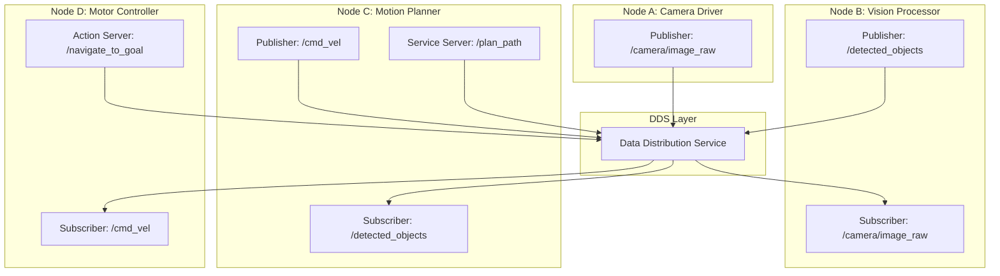

# Module 1: The Robotic Nervous System (ROS 2)

> **Learning Objectives**
> - **LO1**: Understand Physical AI principles, embodied intelligence, and humanoid robot sensor systems
> - **LO2**: Master ROS 2 architecture, nodes, topics, services, actions, and Python-based robot control

**Duration**: Weeks 1–5 (5 weeks)  
**Assessment**: ROS 2 Package Development Project

---

## The Robotic Nervous System Metaphor

The human nervous system is a masterpiece of distributed communication. Your brain does not directly move your muscles — it sends signals through a network of neurons, each responsible for a small part of the overall task. Touch a hot stove and a reflex arc processes the pain signal locally, withdrawing your hand before the signal even reaches your brain for conscious processing.

ROS 2 (Robot Operating System 2) is the robotic nervous system. It is a middleware framework — not an operating system in the traditional sense — that provides the communication infrastructure for every component of a robot to talk to every other component. A camera driver publishes image data. A computer vision node subscribes to that data, processes it, and publishes detected objects. A motion planner subscribes to detected objects and publishes velocity commands. An actuator driver subscribes to velocity commands and moves the motors.

None of these components know or care who else is listening. They publish their outputs and subscribe to their inputs. ROS 2 handles routing, serialisation, discovery, and reliability. This decoupled architecture is what makes complex robotics systems composable, testable, and maintainable.

```
Sensor Driver ──publish──► [/camera/image_raw] ──subscribe──► Vision Node
                                                                    │
                                                              publish
                                                                    ▼
Motion Planner ◄──subscribe──  [/detected_objects]  ◄────────────(done)
       │
  publish
       ▼
[/cmd_vel] ──subscribe──► Motor Controller ──► Robot Moves
```

This communication graph — the **node graph** — is the mental model you will work with throughout Modules 1, 2, 3, and 4.

---

## Module 1 Structure

Module 1 spans five weeks and is divided into two phases:

### Phase 1: Physical AI Foundations (Weeks 1–2)

Before writing a single line of ROS 2 code, you need a solid conceptual foundation:

- **What is Physical AI?** The principles of embodied intelligence, the sense–perceive–plan–act loop, and why physical form factors matter.
- **Humanoid robotics landscape**: the platforms available today (Unitree G1, Boston Dynamics Atlas), where they are being deployed, and why the course focuses on humanoid morphology.
- **Sensor systems**: LiDAR, depth cameras, IMUs, and force-torque sensors — what physical phenomena each measures, how data is digitised, and what ROS 2 message types carry it.

📖 See: [Week 1–2: Physical AI Foundations](/module-1-ros2/week-1-2-foundations)

### Phase 2: ROS 2 Programming (Weeks 3–5)

With the conceptual foundation in place, you build practical ROS 2 skills:

- **Week 3**: ROS 2 architecture deep dive — nodes, topics, the DDS communication layer, `ros2` CLI tools.
- **Week 4**: Services and actions — synchronous request-response (services) vs. long-running tasks with feedback (actions). Writing both server and client sides in Python.
- **Week 5**: Package structure, launch files, parameter servers, URDF, and colcon build system. Building the Assessment 1 package.

📖 See: [Week 3–5: ROS 2 Fundamentals](/module-1-ros2/week-3-5-ros2-fundamentals)  
📖 See: [Week 3–5: ROS 2 Advanced](/module-1-ros2/week-3-5-ros2-advanced)

---

## Why ROS 2 (Not ROS 1)?

ROS 1 was released in 2007 and served the robotics community well for over a decade. ROS 2 was a ground-up redesign launched in 2017, driven by requirements that ROS 1 could not meet:

| Requirement | ROS 1 | ROS 2 |
|-------------|-------|-------|
| Real-time support | No (Python GIL, no DDS) | Yes (DDS middleware, QoS policies) |
| Security | None | DDS-Security standard |
| Multi-robot support | Complicated | First-class citizen |
| Cross-platform | Linux only | Linux, Windows, macOS |
| Python version | Python 2 | Python 3 |
| Active support | End-of-life 2025 | LTS releases (Humble until 2027) |

For Physical AI and humanoid robotics, the real-time and security features of ROS 2 are essential. A robot walking in a human environment cannot have its joint velocity commands delayed by a garbage collection pause.

**This course uses ROS 2 Humble Hawksbill** — the current Long-Term Support (LTS) release, supported until May 2027 on Ubuntu 22.04 LTS.

---

## ROS 2 Architecture Overview



### Key Concepts

**Nodes** are the individual processes in a ROS 2 system. Each node has a name, belongs to a namespace, and communicates via topics, services, and actions.

**Topics** implement publish-subscribe communication. A publisher pushes messages to a topic; any subscriber to that topic receives them. Topics are for continuous data streams (sensor readings, velocity commands, state estimates).

**Services** implement request-response communication. A service client sends a request; the service server processes it and returns a response. Services are for discrete queries that expect a single answer (e.g., "what is the current battery level?").

**Actions** extend services with feedback and cancellation. An action client sends a goal; the action server executes it over time, periodically sending feedback; finally it sends a result. Actions are for long-running tasks (e.g., "navigate to this waypoint").

**Parameters** are named configuration values stored per-node. Nodes declare parameters with defaults; operators can override them at launch time.

---

## Development Environment Setup

### Option A: Native Ubuntu 22.04 Installation

```bash
# 1. Add ROS 2 apt repository
sudo apt install software-properties-common
sudo add-apt-repository universe
sudo curl -sSL https://raw.githubusercontent.com/ros/rosdistro/master/ros.key \
  -o /usr/share/keyrings/ros-archive-keyring.gpg
echo "deb [arch=$(dpkg --print-architecture) signed-by=/usr/share/keyrings/ros-archive-keyring.gpg] \
  http://packages.ros.org/ros2/ubuntu $(. /etc/os-release && echo $UBUNTU_CODENAME) main" \
  | sudo tee /etc/apt/sources.list.d/ros2.list > /dev/null

# 2. Install ROS 2 Humble Desktop
sudo apt update && sudo apt install -y ros-humble-desktop

# 3. Source ROS 2 in every terminal
echo "source /opt/ros/humble/setup.bash" >> ~/.bashrc
source ~/.bashrc

# 4. Verify installation
ros2 --version
# Expected: ros2cli 0.18.x
```

### Option B: Docker (for WSL2 or macOS users)

```bash
docker pull osrf/ros:humble-desktop
docker run -it --rm \
  --env="DISPLAY" \
  --volume="/tmp/.X11-unix:/tmp/.X11-unix:rw" \
  osrf/ros:humble-desktop bash
```

### Verifying Your Installation

```bash
# Terminal 1: start the demo talker
ros2 run demo_nodes_cpp talker

# Terminal 2: start the demo listener
ros2 run demo_nodes_cpp listener

# Expected: listener prints "I heard: Hello World: N" every second
```

---

## Module 1 Deliverable: Assessment 1

**Assessment 1: ROS 2 Package Development Project**

By the end of Week 5, students will submit a ROS 2 Python package that demonstrates mastery of all Module 1 concepts:

- ✅ A publisher node that generates or reads sensor data
- ✅ A subscriber node that processes the data
- ✅ A service server and client for on-demand queries
- ✅ A Python launch file that starts all nodes with configurable parameters
- ✅ A URDF file describing a two-joint robot arm that renders in RViz

Full assessment rubric is in the [Assessments](/assessments) chapter.

---

## Module 1 Prerequisites

- **Python 3.10+**: All ROS 2 Python examples use modern Python. Familiarity with classes, async patterns, and type hints is helpful.
- **Ubuntu 22.04 LTS** or the Cloud-Native alternative (see [Hardware Requirements](/hardware/requirements)).
- **Git**: All assessment submissions are via a public GitHub repository.

No prior robotics experience is required. Module 1 is designed from first principles.
