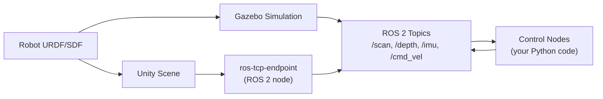

# Module 2: The Digital Twin (Gazebo & Unity)

> **Learning Objectives**
> - **LO3**: Understand the role of physics simulation in the robot development workflow
> - **LO3**: Distinguish between Gazebo (physics-accurate simulation) and Unity (high-fidelity rendering)

**Duration**: Weeks 6–7 (2 weeks)  
**Assessment**: Gazebo Simulation Implementation

---

## Why Simulate Before You Deploy?

Testing robot software on real hardware is slow, expensive, and potentially dangerous. A locomotion controller bug that causes a robot to fall down stairs costs time, damages hardware, and may injure people nearby. A sensor fusion algorithm that computes a wrong position estimate leads a real robot into a wall.

**Simulation** removes these constraints. A robot can be crashed, restarted, and tested in ten different environment configurations in the time it would take to set up a single real-world experiment. Simulation enables:

- **Rapid iteration**: change a parameter, restart the simulation, observe the result in seconds
- **Parallelisation**: run 100 simulations simultaneously to gather training data for reinforcement learning
- **Reproducibility**: two researchers can share a simulation world file and reproduce identical experiments
- **Safety**: test edge cases (cliff detection, emergency stop, collision recovery) without risking hardware

The **Digital Twin** concept extends simulation to a precise, continuously updated virtual replica of a specific real robot and environment. Rather than a generic simulated robot, a digital twin models the exact masses, frictions, motor gains, and sensor characteristics of the physical system it mirrors. Changes tested in the twin can be deployed to the real robot with high confidence.

---

## Two Simulation Tools, Two Purposes

This module covers two simulation environments that serve different purposes and should be used together rather than as alternatives:

```
                 Physics Accuracy   Visual Fidelity   HRI Scenarios
                 ───────────────   ───────────────   ─────────────
Gazebo           ████████████       ████░░░░░░░░       ██░░░░░░░░░
Unity            ████░░░░░░░░       ████████████       ████████████

████ = High capability
```

### Gazebo: Physics-First Simulation

**Gazebo** (now called Gazebo Harmonic/Fortress in its current versions) is the standard open-source robot simulator. It is the primary simulation environment for ROS 2 development. Gazebo excels at:

- **Physics simulation**: rigid body dynamics, collision detection, friction, joint constraints
- **Sensor simulation**: LiDAR ray casting, depth camera projection, IMU noise modelling
- **ROS 2 integration**: first-class `ros_gz_bridge` for bidirectional topic bridging
- **Reproducible experiments**: deterministic physics with a configurable time step

Gazebo is the required environment for Assessment 2 and for all Module 3 Isaac Sim workflows (which build on the same URDF/SDF models).

### Unity: Rendering-First Simulation

**Unity** (with the Unity Robotics Hub packages) provides photorealistic rendering and advanced human-robot interaction simulation. Unity excels at:

- **Visual realism**: physically-based rendering, dynamic lighting, reflections, and materials that match real-world camera appearances
- **Human-robot interaction**: simulating humans in the environment, crowd behaviour, gesture interaction
- **Sensor data for deep learning**: generating photorealistic training images for vision models
- **Smooth integration**: `ros-tcp-connector` publishes and subscribes to ROS 2 topics directly from Unity scripts

Unity is used in this module for visualisation and HRI scenarios. It is not required for Assessment 2.

---

## The Simulation Pipeline



The workflow is:

1. Describe your robot in **URDF/SDF** — joint structure, collision geometries, sensor placements.
2. Load the URDF into **Gazebo** or **Unity** — the simulator creates a physics-accurate replica.
3. The simulator publishes sensor data to **ROS 2 topics** — your control code receives real sensor messages exactly as it would from real hardware.
4. Your control code publishes commands (e.g., `/cmd_vel`) back to ROS 2 — the bridge forwards them to the simulator's actuators.

This means the same Python node that processes `/scan` from Gazebo will work on a real robot without modification, provided the sensor configurations match.

---

## Module 2 Structure

### Week 6–7: Gazebo Simulation

- **Gazebo environment setup**: installing Gazebo Harmonic/Fortress, understanding worlds and models
- **SDF vs URDF**: when to use each format, the `xacro` macro system for parametric URDFs
- **Physics simulation**: configuring inertia, friction, damping, and contact parameters
- **Sensor plugins**: attaching `ray` (LiDAR), `depth_camera`, and `imu` plugins to your robot
- **ROS–Gazebo bridge**: the `ros_gz_bridge` package that connects Gazebo topics to ROS 2 topics
- **Closed-loop control**: writing a ROS 2 Python controller that drives a simulated robot

📖 See: [Week 6–7: Gazebo Simulation](/module-2-digital-twin/week-6-7-gazebo)

### Week 6–7: Unity Simulation

- **Unity Robotics Hub**: installing `com.unity.robotics.urdf-importer` and `com.unity.robotics.ros-tcp-connector`
- **Importing a robot**: loading a URDF into Unity and configuring articulation bodies
- **ROS–Unity bridge**: setting up `ros-tcp-endpoint` as a ROS 2 node and configuring the Unity connector
- **Human simulation**: adding NavMesh agents to simulate humans walking in the environment
- **HRI scenarios**: detecting human proximity, triggering robot behaviour changes

📖 See: [Week 6–7: Unity Simulation](/module-2-digital-twin/week-6-7-unity)

---

## Assessment 2: Gazebo Simulation Implementation

By the end of Week 7, students submit a Gazebo simulation meeting these criteria:

- ✅ A custom robot described in URDF/SDF with at least two actuated revolute joints
- ✅ At minimum two sensor types: a 2D LiDAR and a depth camera publishing to ROS 2 topics
- ✅ A closed-loop ROS 2 Python controller that drives the robot through at least three waypoints
- ✅ Physics interaction evidence: the robot must detect and respond to at least one collision
- ✅ A launch file that starts Gazebo, the robot, the ros_gz_bridge, and the controller together

Full assessment rubric is in the [Assessments](/assessments) chapter.

---

## Prerequisites from Module 1

Module 2 builds directly on Module 1:

- Your robot URDF from Assessment 1 will be used as the starting point for the Gazebo simulation.
- The ROS 2 topics and launch file patterns from Weeks 3–5 are used without modification.
- Understanding TF2 (from Week 3–5 Advanced) is required for working with Gazebo sensor frames.

If you have not yet completed Module 1, work through it before starting Module 2.
