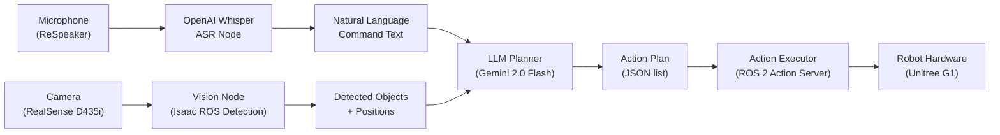

# Module 4: Vision-Language-Action (VLA)

> **Learning Objectives**
> - **LO5**: Design humanoid robot behaviour for natural human-robot interaction
> - **LO6**: Integrate large language models with ROS 2 action planning for conversational robotics

**Duration**: Weeks 11–13 (3 weeks)  
**Assessment**: Capstone — Autonomous Humanoid Robot

---

## The VLA Concept

**Vision-Language-Action (VLA)** models represent the convergence of three previously separate AI disciplines into a unified system:

```
                    VISION
                  (what I see)
                      │
                      ▼
LANGUAGE ────────► VLA Model ────────► ACTION
(what I'm told)                      (what I do)
```

A VLA model takes visual observations (camera images) and language instructions ("pick up the red cube") and outputs robot actions (joint positions, gripper commands, navigation waypoints) — all in a single end-to-end model.

The most capable VLA systems as of 2024–2025 include:
- **RT-2 (Robotics Transformer 2)** by Google DeepMind: a 55B parameter model built on PaLI-X
- **OpenVLA** by Stanford: an open-source 7B parameter VLA based on Llama and DINOv2
- **π0 (Pi-Zero)** by Physical Intelligence: trained on 10,000+ hours of robot data

These end-to-end models are state of the art but require enormous compute and training data. This course teaches the **modular VLA approach** — connecting existing LLM, vision, and ROS 2 action components — which is more practical for coursework and generalises to production robotics systems.

---

## The Modular VLA Architecture

Rather than one monolithic model, the modular approach chains specialised components:



Each module is independently replaceable:
- Whisper can be swapped for a different ASR model
- Gemini 2.0 Flash can be swapped for GPT-4o or a local LLM
- Isaac ROS detection can be swapped for a different vision model
- The action executor is standard ROS 2 — it works with any robot that has an action server

---

## Module 4 Structure

### Weeks 11–12: Humanoid Robot Design

- Humanoid kinematics: forward kinematics, inverse kinematics, Denavit-Hartenberg notation
- Dynamics and balance control: centre-of-mass, ZMP criterion, whole-body controllers
- Bipedal locomotion: gait generation, stability, stair climbing
- Manipulation and grasping with articulated hands
- HRI design principles: proxemics, social cues, gesture recognition

📖 See: [Weeks 11–12: Humanoid Robot Design](/module-4-vla/week-11-12-humanoid)

### Week 13: Conversational Robotics

- OpenAI Whisper for voice-to-action pipelines
- LLM-based cognitive planning: prompting, structured output, action vocabularies
- Multi-modal interaction: speech + vision + gesture
- Building and testing the complete Capstone system
- Safety and fallback design for LLM-based control

📖 See: [Week 13: Conversational Robotics](/module-4-vla/week-13-conversational)

---

## Capstone Assessment: The Autonomous Humanoid

**Assessment 4: Capstone Project — Autonomous Humanoid**

The Capstone brings together every module into a single end-to-end system:

1. The robot receives a voice command ("bring me the blue box from the shelf")
2. Whisper transcribes the command to text
3. An LLM planner interprets the command and generates an action plan
4. Isaac ROS vision locates the target object
5. Nav2 navigates the robot to the object
6. The manipulation pipeline grasps and relocates the object
7. The robot confirms task completion with a spoken response

**Acceptance criteria**:
- Voice command accepted and transcribed with ≤2 word error rate on three test commands
- Action plan generated and validated against the robot's action vocabulary within 3 seconds
- Target object detected with ≥80% confidence
- Robot navigates to within 0.3m of the object without collision
- Grasp attempted; success rate ≥60% for objects ≥5cm in any dimension
- System handles at least one error gracefully (unknown command, detection failure, navigation obstacle)

Full rubric is in the [Assessments](/assessments) chapter.

---

## Why VLA Is the Frontier of Physical AI

The modular VLA stack in this course is not just a pedagogical exercise. It mirrors what production Physical AI teams build:

- **Boston Dynamics Spot** uses a similar architecture: a language model generates navigation goals, a vision model detects objects and obstacles, Nav2-equivalent stacks handle path planning.
- **Unitree's commercial platform** SDK provides action server interfaces that the LLM planner dispatches to — exactly the architecture this module builds.
- **Amazon Robotics** uses an LLM-to-action-plan pipeline in their order fulfilment centres.

Mastering this modular VLA approach means you can build on top of it as better LLMs, vision models, and robot platforms emerge — the architecture stays the same even as the components improve.
